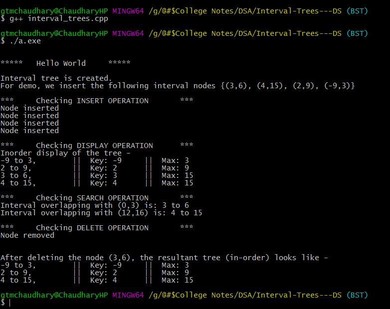

# Interval Trees-DS
This file contains implementation of INTERVAL TREES with combined data structures of BST (Binary Search Tree).

### Major Operations
1. INSERT  --> Used to 'insert' interval nodes into BST
2. SEARCH   --> Used to 'search' for overlap of given interval in the BST
3. REMOVE   --> Used to 'remove' an interval from BST
4. FIND   --> Used to search if given interval 'exists' in the BST or not

### Following is the screenshot of Output

